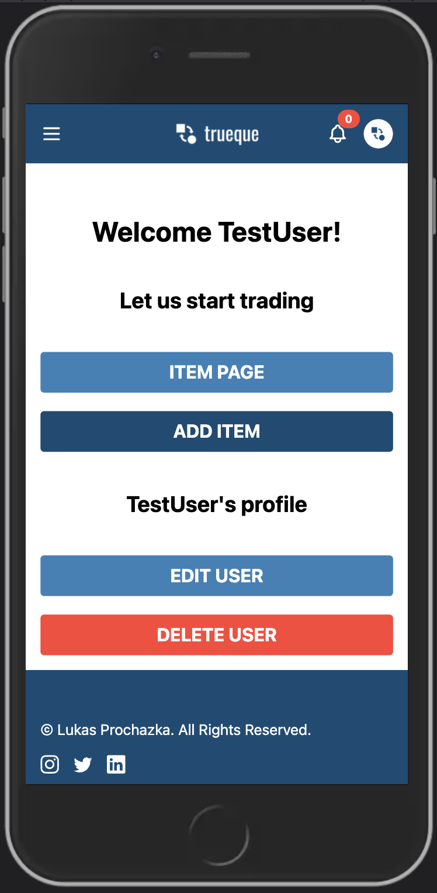
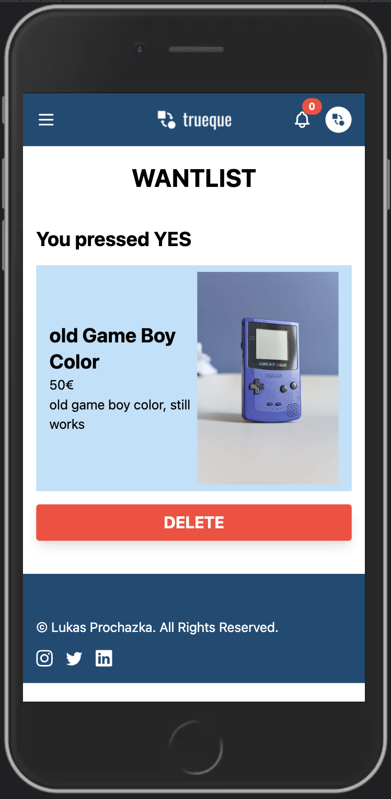
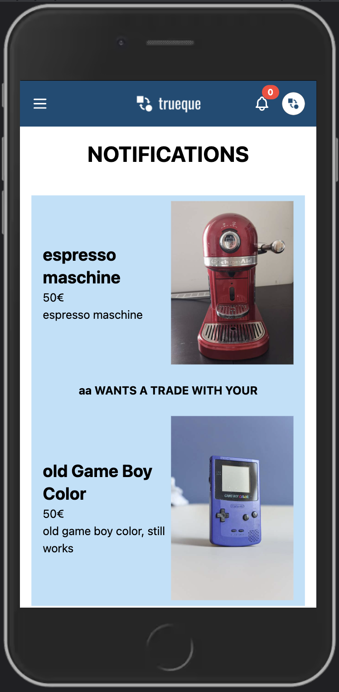

# TRUEQUE

## Trueque is a item exchange platform, where users can upload items and search for items they want to swap!

## Description

Upload images from items you want to swap. Add a price and start searching for items in your price range. If you like an item you can click yes and the owner of the item gets a notification and can accept your trade or delete it. if the owner accept the trade, the trade offer moves to the trade overview. At the trade overview you can start talking to each other by mail. On the details page you can see the item you want in detail, and see a middlewaypoint.

## Functionalities

- A landing page
- User Registration, Login. Logout, user edit and user delete.
- Item upload with images. Edit and delete an item.
- A item exchange site, where you find items in your price range. Click yes or no, if you like or don't like the item.
- A wantlist page. All items you liked are on this page.
- The Notification page. If you like the item, the other user gets a notification.
- Trade overview to see what items got accepted.
- A trade detail page, there you see all details about the item, and a middlewaypoint.
- Mail button for direct mails to the other user, to exchange information.

## Technologies

- Next.js
- TypeScript
- JavaScript
- PostgreSQL
- TailwindCSS
- Jest unit tests
- Cypress E2E tests
- FIGMA
- DrawSQL

## Setup instructions

- Clone the repository with `git clone <repo>`
- Setup the database by downloading and installing PostgreSQL
- Create a user and a database
- Create a new file `.env`
- Copy the environment variables from `.env-example` into `.env`
- Replace the placeholders xxxxx with your username, password and name of database
- Install dotenv-cli with `yarn add dotenv-cli`
- Run `yarn install` in your command line
- Run the migrations with `yarn migrate up`
- Start the server by running `yarn dev`

## Deploy on Heroku

- Sign up at Heroku: https://www.heroku.com/.
- Create a new App
- Choose a name and select the "Europe" Region
- Click "Connect to GitHub"
- Search for your repository and click on "Connect". Click on "Enable Automatic Deploys"
- Go to the Overview tab and click "Configure Add-On"
- Search for "Postgres" and select "Heroku Postgres"
- Trigger a deploy by pushing your repo to GitHub

## Screenshots

### Personal User Page

### Item Page

### Item Exchange Page

### Item Exchange Page Yes No

### Want Page

### Notification Page

### Notification Page Buttons

### Trade Overview

### MiddleWayPoint

